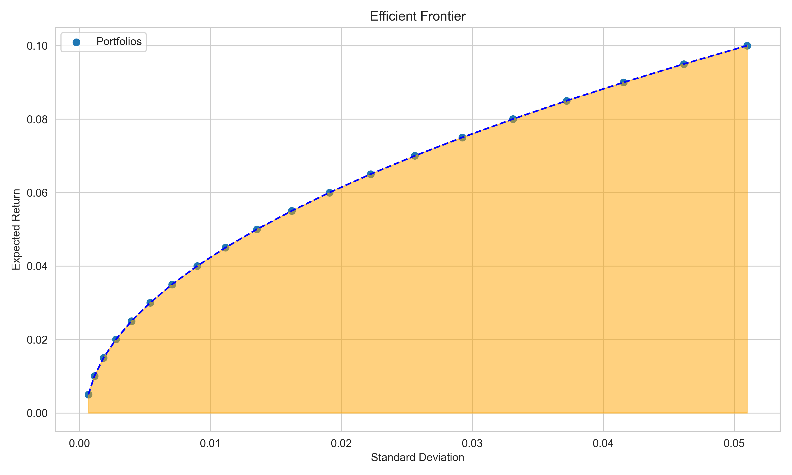

# Markowitz-Portfolio-Optimization 

This repository contains coursework completed for the **Computational Finance with C++** module in the MSc Fintech programme at Imperial College Business School.

## 📘 Overview

This project implements the **Markowitz mean-variance portfolio optimization model** (Markowitz, 1959) — the cornerstone of **Modern Portfolio Theory (MPT)**. MPT suggests that investors can minimize portfolio risk for a given level of expected return by carefully allocating asset weights based on historical returns and covariances (Elton & Gruber, 1997).

Key contributions:
- Exploratory data analysis (EDA)
- Theoretical derivation of the Markowitz optimization problem
- Implementation of a C++ solver for portfolio construction
- Out-of-sample backtesting and performance evaluation

## 🧠 Theoretical Background

Given:
- Number of assets: *N*
- Expected returns: **r̄** = *(r̄₁, r̄₂, ..., r̄ₙ)*

The objective is to **minimize portfolio variance**:

Minimize: (1/2) * **wᵀ Σ w**

Subject to the constraints:
- **wᵀ r̄** = rₚ (target return)  
- **wᵀ e** = 1 (fully invested portfolio)

Where:

- **w** = *(w₁, w₂, ..., wₙ)* is the vector of portfolio weights  
- **e** = *(1, 1, ..., 1)* is a vector of ones  
- **Σ** is the covariance matrix of asset returns  

This quadratic programming problem can be solved using **Lagrange multipliers**, which leads to a linear system involving **Σ**, **r̄**, and **e**. The full implementation is detailed in the code section.

## 📁 Project Structure

- `data/`
  - `asset_returns.csv` and `asset_returns_small.csv`: Time-series asset return data (each column represents a asset)
- `cpp code/`
  - `Main.cpp`, `read_data.h`, `constructMatrix.h`, `inverse_adjoint_matrix.h`, `inverse_LUdecomposition.h`, `parameter_estimation.h`
- `py_plot/`
  - Python scripts for visualizing results
- `results/`
  - `result.csv`: Output of average returns and covariances across simulations
  - `weight(rp=0.005).csv`: Asset weights for a portfolio with 0.5% target return
- `pics/`
  - output figures
- `analysis.pdf`
  - a detailed analysis of the project

> ⚠️ **Note:** Please update the data file paths to match your local environment 

### Key C++ Classes

| Class | File | Description |
|-------|------|-------------|
| `CSV` | `read_data.h` | Imports data from CSV |
| `parameter_estimation` | `parameter_estimation.h` | Calculates sample mean and covariance |
| `constructMatrix` | `constructMatrix.h` | Matrix operations: multiplication, merging, rank, etc. |
| `adjoint` | `inverse_adjoint_matrix.h` | Matrix inversion via adjugate (not used in final) |
| `inverse_LUdecomposition` | `inverse_LUdecomposition.h` | Matrix inversion via LU decomposition (final implementation) |

## ⚙️ Workflow for `main.exe`

1. **Data Import**
2. **Windowing**:
   - First 100 time periods as in-sample
   - Next 12 periods as out-of-sample
3. **Target Returns**:
   - Range: 0.5% to 10%, in 0.5% increments
4. **Portfolio Optimization**:
   - For each target return:
     - Estimate mean and covariance
     - Construct Lagrangian system
     - Solve for optimal weights using LU decomposition
     - Record performance in out-of-sample window
5. **Rolling Backtest**:
   - Repeat steps with updated windows for 50 rounds
6. **Results**:
   - Save average return and covariance for each portfolio to `result.csv`

## 📊 Efficient Frontier

## 📚 References

- Markowitz, H. (1959). *Portfolio Selection*. Yale University Press.
- Elton, E. J., & Gruber, M. J. (1997). Modern portfolio theory, 1950 to date. *Journal of Banking & Finance*, 21(11-12), 1743–1759.
- Sharpe, W. F. (1994). The Sharpe ratio. *The Journal of Portfolio Management*, 21(1), 49–58.
- Jegadeesh, N., & Titman, S. (1993). Returns to buying winners and selling losers: Implications for stock market efficiency. *The Journal of Finance*, 48(1), 65–91.

